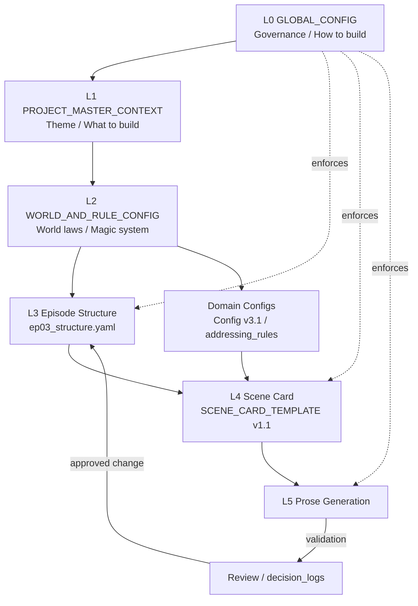

# Kannagi Diary Devlog

## Narrative Design for the Age of AI

This repository is not a collection of stories.

It is an experiment in **designing narrative as a structured system**, where AI generates stories under explicitly defined constraints.

---

## What This Project Is

This project explores:

- Narrative as a **constraint system**
- AI-assisted story generation with **explicit structure**
- Long-form consistency through **config-driven design**

Instead of writing text directly, this project defines:
- World rules
- Character behavior
- Scene structure
- Generation constraints

Stories are the result of these systems.

## System Architecture

---

## Current Focus (2026)

The project is currently focused on:

### 1. Multi-layer Config System

- `PROJECT_MASTER_CONTEXT` (What to build)
- `GLOBAL_CONFIG` (How to build)
- Domain configs (Detailed rules)

These ensure:
- Stability over long sessions
- Explicit control over narrative generation
- Prevention of structural drift

---

### 2. Structure Governance

Narrative structure is strictly controlled:

- Scene structure (SC) is fixed
- Any structural modification requires explicit approval
- No silent changes are allowed

This introduces **governance into AI narrative generation**.

---

### 3. Act II – EP03 (Current Development)

Episode 03 opens the second act. It introduces structural problems that
EP01/EP02 never had to solve:

- **10 scenes across multiple locations** (vs. a single-incident chapter)
- **Dual-line alternating progression** (SC04–SC07), converging at SC07
- **Cliffhanger enforcement** — every scene must end on a hook
- **Non-converging tension curve** — the chapter ends suspended, still rising

EP03 also separates **witnessing** from **participating** as a hard structural
constraint: the protagonist may only witness the climax, never join it.

EP02 (structural trap design — misdirection, perception control, explicitly
defined narrative "lies") is complete and retained as a reference case.

---

### 4.Relation Expression Layer

The project now separates character addressing rules into an independent file:

- `addressing_rules.yaml`

This layer manages:

- character-to-character forms of address
- honorifics and psychological distance
- event-triggered changes in how characters call each other

This prevents dialogue drift during AI-assisted generation.

---

### 5. World Law Layer (L2)

`WORLD_AND_RULE_CONFIG.yaml` isolates world laws — the origin and principles of
magic, ability structure, and social rules — from character behavior configs.

This file is **not a reference to fill gaps with. It is a specification to
validate against.** Generated prose is checked for deviation from it.

---

### 6. Conventions

- **Encoding:** UTF-8, LF, no BOM. Shift_JIS is prohibited.
- **Change history:** `raw/decision_logs/CHANGELOG.md`
- **Governance:** conflicts must be reported, never silently resolved.

---

## Quick Start

If you are new to this repository:

1. Read the current state:
   - `docs/00_current_state.md`

2. Understand the system:
   - `docs/10_config_design.md`

3. See actual structure:
   - `raw/episodes/ep03_structure.yaml` (current)
   - `raw/episodes/ep02_structure.yaml` (reference)

4. Check core configs:
   - `raw/Config/GLOBAL_CONFIG.yaml` (L0)
   - `raw/Config/PROJECT_MASTER_CONTEXT.yaml` (L1)
   - `raw/Config/WORLD_AND_RULE_CONFIG.yaml` (L2)
   - `raw/Config/Config_v3.1.yaml` (current domain config)

5. Read the change history:
   - `raw/decision_logs/CHANGELOG.md`

---

## Repository Structure

docs/        Edited documentation and design notes

raw/         Source materials: configs, YAML files, episode structures

raw/decision_logs/   Change history and design decision records

archive/     Deprecated versions, rejected drafts, generated drafts

templates/   Reusable templates for configs and scene cards

characters/  Character-related reference materials

diagrams/    System and narrative structure diagrams

---

## Why This Matters

Most AI-generated narratives fail because:

- Constraints degrade over time
- Structure is not enforced
- Systems rely on memory instead of design

This project addresses that by:

- Designing structure first
- Making rules explicit
- Treating narrative as a controllable system

---

## Core Idea

> Narrative is not written.
>  
> Narrative emerges from constraints.

---

## External Links

- Devlog (Japanese): https://note.com/tokyoscarecrow/
- LinkedIn (English summaries): https://www.linkedin.com/in/yoshidaryo/

---

## Status

- Config system: Active (v3.1)
- Governance system: Active
- EP01 / EP02: Structure complete
- EP03 (Act II): In development — SC01–SC03 defined

---

# かんなぎダイアリー 開発ログ

## AI時代のナラティブ設計

このリポジトリは物語集ではない。

これは、**物語を構造として設計する実験**である。

AIは文章を書くのではなく、  
**明示された制約のもとで物語を生成する**。

---

## このプロジェクトとは

本プロジェクトは以下を探求する：

- ナラティブ＝制約システム
- 構造を前提としたAI生成
- Configによる長編一貫性の維持

直接テキストを書くのではなく、

- 世界観
- キャラクター
- シーン構造
- 生成ルール

を定義し、物語を生み出す。

---

## 現在の焦点（2026年）

### 1. 多層Config構造

- PROJECT_MASTER_CONTEXT（何を作るか）
- GLOBAL_CONFIG（どう作るか）
- 各種ドメインConfig

これにより：

- 長期安定性
- 制御可能な生成
- 構造ドリフト防止

を実現する。

---

### 2. 構造ガバナンス

ナラティブ構造は厳密に管理される：

- SC構造は固定
- 変更は承認制
- 無断変更は禁止

AI生成に「統制」を導入する。

---

### 3. 第二幕：EP03（現在の主実験）

第三章は第二幕の開幕であり、EP01／EP02 では発生しなかった構造課題を扱う。

- **複数舞台・全10話構成**（単一事件の章とは前提が異なる）
- **2ライン交互進行**（SC04〜SC07）と、SC07での収束
- **全SCラストのクリフハンガー義務化**
- **緊張曲線を収束させない**（上昇したまま章を閉じる）

さらに「**目撃**」と「**加担**」の分離を構造条件として固定している。
主人公はクライマックスを目撃するのみで、加担は次章へ繰り越す。

EP02（誤誘導・認知操作・「嘘」の構造化）は完了し、参照事例として保持する。

---

### 4. 呼称・関係表現レイヤー

キャラクター同士の呼び方は、独立した設定ファイルとして管理する。

- `addressing_rules.yaml`

このレイヤーでは以下を扱う：

- キャラクター間の呼称
- 敬称と心理距離
- 特定イベント後に発生する呼称変化

これにより、会話生成時の呼称ブレを抑制する。

---

### 5. 世界法則レイヤー（L2）

`WORLD_AND_RULE_CONFIG.yaml` により、世界法則（魔法の起源・原理・能力構成・
社会規則）をキャラクター挙動Configから分離した。

本ファイルは「**参照して補う**」ものではなく、「**逸脱していないかを検証する**」
ためのものである。

---

### 6. 規約

- **文字コード**：UTF-8 / LF / BOMなし。Shift_JIS は禁止
- **変更履歴**：`raw/decision_logs/CHANGELOG.md`
- **ガバナンス**：矛盾は報告する（黙って修正しない）

---

## クイックスタート

初めて読む場合：

1. 現在状態：
   - `docs/00_current_state.md`

2. 設計思想：
   - `docs/10_config_design.md`

3. 構造：
   - `raw/episodes/ep03_structure.yaml`（現行）
   - `raw/episodes/ep02_structure.yaml`（参照）

4. コアConfig：
   - `raw/Config/GLOBAL_CONFIG.yaml`（L0）
   - `raw/Config/PROJECT_MASTER_CONTEXT.yaml`（L1）
   - `raw/Config/WORLD_AND_RULE_CONFIG.yaml`（L2）
   - `raw/Config/Config_v3.1.yaml`（現行ドメインConfig）

5. 変更履歴：
   - `raw/decision_logs/CHANGELOG.md`

---

## リポジトリ構成

docs/        編集済みドキュメント

raw/         YAML・Config・EP構造などの一次資料

raw/decision_logs/   変更履歴・設計判断の記録

archive/     旧版・廃案

templates/   再利用テンプレート

characters/  キャラクター関連資料

diagrams/    図解

---

## なぜ重要か

多くのAI生成は失敗する：

- 制約が崩壊する
- 構造が維持されない
- 設計ではなく記憶に依存する

本プロジェクトはそれを解決する。

---

## コアアイデア

> 物語は書くものではない  
> 制約から生成されるものである

---

## 外部リンク

- 開発記（日本語）：https://note.com/tokyoscarecrow/
- LinkedIn（英語）：https://www.linkedin.com/in/yoshidaryo/

---

## 状態

- Configシステム：稼働中（v3.1）
- ガバナンス：運用中
- EP01／EP02：構造確定
- EP03（第二幕）：開発中 — SC01〜SC03 定義済み
