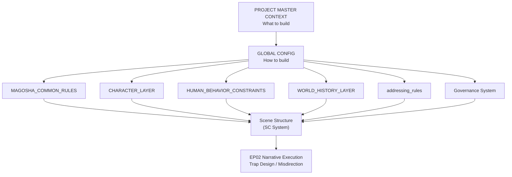

# Kannagi Diary Devlog

## Narrative Design for the Age of AI

This repository is not a collection of stories.

It is an experiment in **designing narrative as a structured system**, where AI generates stories under explicitly defined constraints.

---

## What This Project Is

This project explores:

- Narrative as a **constraint system**
- AI-assisted story generation with **explicit structure**
- Long-form consistency through **config-driven design**

Instead of writing text directly, this project defines:
- World rules
- Character behavior
- Scene structure
- Generation constraints

Stories are the result of these systems.

## System Architecture


---

## Current Focus (2026)

The project is currently focused on:

### 1. Multi-layer Config System

- `PROJECT_MASTER_CONTEXT` (What to build)
- `GLOBAL_CONFIG` (How to build)
- Domain configs (Detailed rules)

These ensure:
- Stability over long sessions
- Explicit control over narrative generation
- Prevention of structural drift

---

### 2. Structure Governance

Narrative structure is strictly controlled:

- Scene structure (SC) is fixed
- Any structural modification requires explicit approval
- No silent changes are allowed

This introduces **governance into AI narrative generation**.

---

### 3. EP02 – Structural Trap Design

Episode 02 is used as a test case for:

- Misdirection design
- Perception manipulation
- Explicitly defined narrative “lies”

The goal is to design **how readers misinterpret events**.

---

## Quick Start

If you are new to this repository:

1. Read the current state:
   - `docs/00_current_state.md`

2. Understand the system:
   - `docs/10_config_design.md`

3. See actual structure:
   - `raw/episodes/ep02_structure.yaml`

4. Check core configs:
   - `raw/Config/PROJECT_MASTER_CONTEXT.yaml`
   - `raw/Config/GLOBAL_CONFIG.yaml`

---

## Repository Structure

```text
docs/        Edited documentation and design notes
raw/         Source materials: configs, YAML files, episode structures
archive/     Deprecated versions, rejected drafts, generated drafts
templates/   Reusable templates for configs and scene cards
characters/  Character-related reference materials
diagrams/    System and narrative structure diagrams

---

## Why This Matters

Most AI-generated narratives fail because:

- Constraints degrade over time
- Structure is not enforced
- Systems rely on memory instead of design

This project addresses that by:

- Designing structure first
- Making rules explicit
- Treating narrative as a controllable system

---

## Core Idea

> Narrative is not written.
>  
> Narrative emerges from constraints.

---

## External Links

- Devlog (Japanese): https://note.com/tokyoscarecrow/
- LinkedIn (English summaries): https://www.linkedin.com/in/yoshidaryo/

---

## Status

- Config system: Active
- Governance system: Active
- EP02: In development

---

# かんなぎダイアリー 開発ログ

## AI時代のナラティブ設計

このリポジトリは物語集ではない。

これは、**物語を構造として設計する実験**である。

AIは文章を書くのではなく、  
**明示された制約のもとで物語を生成する**。

---

## このプロジェクトとは

本プロジェクトは以下を探求する：

- ナラティブ＝制約システム
- 構造を前提としたAI生成
- Configによる長編一貫性の維持

直接テキストを書くのではなく、

- 世界観
- キャラクター
- シーン構造
- 生成ルール

を定義し、物語を生み出す。

---

## 現在の焦点（2026年）

### 1. 多層Config構造

- PROJECT_MASTER_CONTEXT（何を作るか）
- GLOBAL_CONFIG（どう作るか）
- 各種ドメインConfig

これにより：

- 長期安定性
- 制御可能な生成
- 構造ドリフト防止

を実現する。

---

### 2. 構造ガバナンス

ナラティブ構造は厳密に管理される：

- SC構造は固定
- 変更は承認制
- 無断変更は禁止

AI生成に「統制」を導入する。

---

### 3. EP02：トラップ設計

現在の主実験：

- 誤誘導の設計
- 認知操作
- 「嘘」の構造化

読者がどのように誤解するかを設計する。

---

## クイックスタート

初めて読む場合：

1. 現在状態：
   - `docs/00_current_state.md`

2. 設計思想：
   - `docs/10_config_design.md`

3. 構造：
   - `raw/episodes/ep02_structure.yaml`

4. コアConfig：
   - `raw/Config/PROJECT_MASTER_CONTEXT.yaml`
   - `raw/Config/GLOBAL_CONFIG.yaml`

---

## リポジトリ構成

docs/ → 編集済みドキュメント
raw/ → YAML・構造・一次資料
archive/ → 廃案・旧版
templates/ → テンプレート

---

## なぜ重要か

多くのAI生成は失敗する：

- 制約が崩壊する
- 構造が維持されない
- 設計ではなく記憶に依存する

本プロジェクトはそれを解決する。

---

## コアアイデア

> 物語は書くものではない  
> 制約から生成されるものである

---

## 外部リンク

- 開発記（日本語）：https://note.com/tokyoscarecrow/
- LinkedIn（英語）：https://www.linkedin.com/in/yoshidaryo/

---

## 状態

- Configシステム：稼働中
- ガバナンス：運用中
- EP02：開発中
